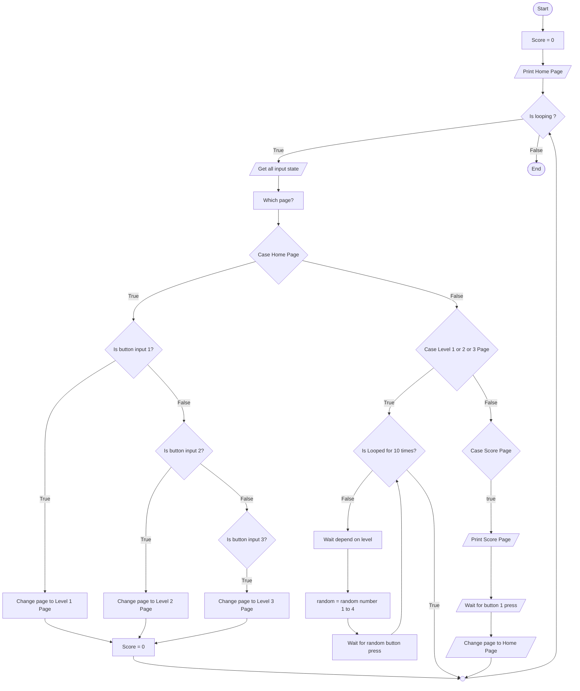

# WeMos Hand Grip Game

## Flowchart

```mermaid
    flowchart TD;
        Start([Start]) --> A1[Score = 0] --> A2[/Print Home Page/]
        A2 --> Loop{Is looping ?}
        ToLoop(( )) --> Loop
        Loop --> |True| GetAll1[/Get all input state/]
        GetAll1 --> WhichPage[Which page?]
        WhichPage --> HomePage{Case Home Page}
        HomePage --> |True| HomeP1{Is button input 1?}
        HomeP1 --> |True| HomeP1Act[Change page to Level 1 Page]
        HomeP1 --> |False| HomeP2{Is button input 2?}
        HomeP2 --> |True| HomeP2Act[Change page to Level 2 Page]
        HomeP2 --> |False| HomeP3{Is button input 3?}
        HomeP3 --> |True| HomeP3Act[Change page to Level 3 Page]
        HomeP1Act & HomeP2Act & HomeP3Act --> HomeP01[Score = 0] --> ToLoop
        HomePage --> |False| LevelPage{Case Level 1 or 2 or 3 Page}
        LevelPage --> |True| LevelLoop{Is Looped for 10 times?}
        LevelLoop --> |True| ToLoop
        LevelLoop --> |False| LevelLoop1[Wait depend on level] --> LevelLoop2[random = random number 1 to 4] --> LevelLoop3[Wait for random button press] --> LevelLoop
        LevelPage --> |False| ScorePage{Case Score Page}
        ScorePage --> |true| ScoreP1[/Print Score Page/] --> ScoreP2[/Wait for button 1 press/] --> ScoreP3[/Change page to Home Page/] --> ToLoop
        Loop --> |False| End([End])
```
